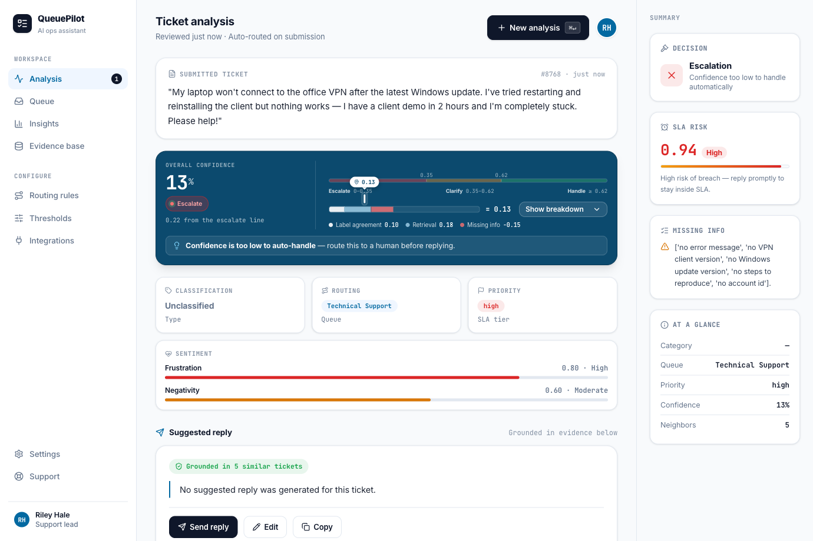

# QueuePilot

[](https://github.com/beansint/queuepilot/actions/workflows/ci.yml)
[](LICENSE)
[](pyproject.toml)

**▶ Live demo: https://queuepilot-jjpg.onrender.com** (invite-gated — ask for an access code).

An **agentic AI ticketing system** for IT/helpdesk support: paste a ticket and get back a routed
queue, priority, similar historical cases, and a confidence score — built on **hybrid retrieval**
(dense + sparse) over a real support-ticket corpus, with a guarded "support copilot" workflow.

> **Status:** Slices **A–E complete**. `/analyze` runs a LangGraph guarded-copilot workflow over
> hybrid retrieval on 3,000 real tickets; a Vite/React console + LangSmith tracing + `--explain`
> ship the observability layer; a LangSmith eval suite (offline + online + calibration + feedback
> flywheel) grades it; and the whole thing is Dockerized and **deployed to Render** behind invite-code
> auth + rate limiting. See [Roadmap](#roadmap).

It's also a **learning project**: every component ships a concept doc + runnable script + self-quiz
(see [The learning layer](#the-learning-layer)).



---

## What it does

`POST /analyze` with ticket text → a structured envelope produced by a guarded LangGraph copilot —
routing, calibrated confidence, sentiment, SLA risk, and (when confident enough) a grounded reply:

```bash
curl -s -X POST localhost:8000/analyze -H 'Content-Type: application/json' \
  -d '{"text":"I was charged twice for my subscription this month and need a refund"}'
```
```jsonc
{
  "category": "Incident",
  "queue": "Billing and Payments",
  "priority": "low",
  "confidence": 0.841,                 // calibrated blend: retrieval agreement + score + LLM/vote consistency
  "similar_tickets": [                 // real neighbors from the corpus, hybrid-ranked
    {"score": 0.42, "queue": "Billing and Payments", "snippet": "..."},
    {"score": 0.41, "queue": "Billing and Payments", "snippet": "..."}
  ],
  "sentiment": {"frustration": 0.3, "negativity": 0.2},
  "sla_risk": 0.18,
  "escalate": false,
  "clarification": null,               // filled instead of suggested_reply when details are missing
  "suggested_reply": "Thanks for flagging the duplicate charge — I can see two charges on ...",
  "trace": {
    "enabled": true, "run_id": "1b2c...", "url": "https://smith.langchain.com/...",
    "latency_ms": 842.3, "project": "queuepilot"
  }
}
```

A unanimous neighborhood (above) yields **high confidence**, which routes straight to a grounded
`suggested_reply`; a mixed neighborhood or missing details routes to `clarification` instead, and
genuine uncertainty or extreme SLA risk sets `escalate: true` with both left `null`. The score is
explainable and tunable — never raw LLM self-confidence (see
[calibrated confidence](#how-it-works--five-upgrades-over-classic-rag) below).

Pass `?explain=true` to also get a `debug` step-by-step reasoning trail (see
[Observability & `--explain`](#observability---explain)). `POST /feedback` records a thumbs
up/down plus optional correction against a run's `trace.run_id`, feeding the eval flywheel.

## Architecture

`POST /analyze` runs a compiled LangGraph `StateGraph` (`app/analyze/graph.py`, `GraphAnalyzer`)
behind the same contract the API has always exposed:

```
START ─► retrieve ─► classify ─► sentiment ─► assess_missing ─► score ─► decide ◇
           │            │            │              │             │        ├─ answer   ─► draft_reply ─► END
    hybrid dense+     LLM picks   LLM scores    LLM lists       deterministic├─ clarify  ─► clarify     ─► END
    sparse retrieval  category/   frustration/  missing detail  confidence + └─ escalate ───────────────► END
    (Pinecone)         queue/     negativity    strings         sla_risk (never
                      priority                                  raw LLM self-confidence)
```

- **Hybrid retrieval** — dense (Voyage `voyage-3.5-lite`, 1024d) for meaning + sparse (BM25) for
  exact keywords, fused in a single Pinecone dotproduct index with an alpha weight.
- **Provider registry** — embeddings and chat both sit behind protocols (`Embedder`, `ChatModel`);
  swap providers (Voyage / Gemini embeddings, Groq chat) with an env var.
- **Contract-first** — the `AnalyzeResponse` envelope (`app/schemas.py`) was fixed from day one; the
  full graph now populates every field, no shape changes needed along the way.
- **Calibrated confidence** — `app/analyze/scoring.py` blends retrieval label-agreement, a
  sigmoid-scaled top score, and LLM/majority-vote consistency (with a missing-info penalty) into one
  `confidence`, and blends priority + frustration + missing-info into `sla_risk`. Both are observable,
  tunable signals — never the model's own stated confidence.
- **Guarded routing** — `route_decision` (in `graph.py`) picks `answer` / `clarify` / `escalate` from
  `confidence` + `sla_risk` + missing info, so the copilot drafts a grounded reply when it's sure,
  asks a clarifying question when details are thin, and hands off to a human when it isn't sure or
  SLA risk is extreme — every LLM node degrades gracefully on failure rather than raising.
- **Observability** — LangSmith tracing on every run plus an in-app `--explain` reasoning trail (see
  below); a Vite/React console visualizes it all.
- **Eval suite** (`eval/`) — offline `evaluate()` experiments, online eval, calibration/ECE checks,
  an LLM-as-judge evaluator, and a feedback flywheel that turns `POST /feedback` corrections into new
  eval examples.
- **Deploy** — one Docker image (console + API) shipped to Render, gated by invite-cookie auth and
  per-IP/daily rate limiting.

Canonical design docs live in [`docs/final-build-plan/`](docs/final-build-plan/) (start with its
`README.md`).

## How it works — five upgrades over classic RAG

1. **Hybrid retrieval** — dense + sparse fusion in one Pinecone index, not just cosine-similarity
   nearest neighbors.
2. **Structured output** — every response is a validated, forward-compatible Pydantic envelope, not
   free-text.
3. **LangGraph assembly line** — retrieve → classify → sentiment → assess → score → decide, as
   discrete, testable, resumable nodes instead of one monolithic prompt.
4. **Calibrated confidence** — a blend of observable signals (retrieval agreement, score, label
   consistency), not the model's own stated confidence.
5. **Guarded routing + explainability** — the graph answers, clarifies, or escalates based on that
   calibrated score, and `--explain` / LangSmith trace every step so the decision is auditable.

## Stack

FastAPI · LangGraph (guarded copilot workflow) · Pinecone (sparse-dense hybrid) · Voyage embeddings
(registry-swappable) · `pinecone-text` BM25 · Groq chat (registry-swappable) · Pydantic · `uv` ·
ruff + mypy(strict) + pytest · GitHub Actions CI. A React/Vite/Tailwind/shadcn console (served by
this same FastAPI app) is the front end, with LangSmith tracing wired through every `/analyze` call
and an offline + online eval suite (calibration/ECE, LLM-as-judge, feedback flywheel) grading it.
The whole thing ships as one Docker image, deployed to Render.

## Quickstart

Requires [`uv`](https://docs.astral.sh/uv/) and Python 3.11+.

```bash
uv sync                                   # install deps into .venv
cp .env.example .env                      # then fill in keys (see below)

uv run python data/download.py            # fetch the Kaggle corpus into data/raw/ (needs Kaggle token)
uv run python data/ingest.py              # normalize → embed → BM25 → upsert ~3k tickets to Pinecone
                                          #   paid tier? add:  --rpm 5000 --batch 100   (skips throttle)

uv run uvicorn app.main:app --reload      # serve the API at http://localhost:8000
#   GET  /health     • POST /analyze     • POST /analyze?explain=true
```

**Keys** (`.env`, server-side only — see `.env.example`):
`VOYAGE_API_KEY` (embeddings; 200M free tokens) · `PINECONE_API_KEY` · `KAGGLE_USERNAME`/`KAGGLE_KEY`
(dataset download). `EMBEDDING_PROVIDER=voyage` by default; set `gemini` (+ `GEMINI_API_KEY`,
`EMBED_DIM=768`) to swap.

**Develop:**
```bash
uv run pytest -q                # unit tests (live integration is gated, see below)
uv run ruff check . && uv run mypy app tests learn data
QUEUEPILOT_RUN_INTEGRATION=1 uv run pytest -m integration   # live: real Voyage + Pinecone
```

## Observability & `--explain`

Every `/analyze` call carries a `trace` summary; passing `?explain=true` also fills a `debug`
reasoning trail — both are additive fields on the existing envelope, `null`/no-op when unused.

```bash
# enable LangSmith tracing (server-side only; omit to run fully offline — trace.enabled: false)
export LANGSMITH_API_KEY=...
export LANGSMITH_PROJECT=queuepilot   # optional, defaults per LangSmith config

# opt-out debug mode: adds an in-app step-by-step reasoning trail to the response
curl -s -X POST 'localhost:8000/analyze?explain=true' -H 'Content-Type: application/json' \
  -d '{"text":"I was charged twice for my subscription this month and need a refund"}'
```
```jsonc
{
  // ...category / queue / priority / confidence / similar_tickets / sentiment / etc. as usual...
  "trace": {"enabled": true, "run_id": "...", "url": "https://smith.langchain.com/...", "latency_ms": 842.3, "project": "queuepilot"},
  "debug": {"steps": [{"node": "retrieve", "summary": "...", "data": {}}, "..."]}
}
```
Without `?explain=true`, `debug` stays `null`. Without a LangSmith key, `trace.enabled` is `false`
and the rest of `trace` is `null` — no external calls, no error. See
[`docs/final-build-plan/09-SLICE-C-DESIGN.md`](docs/final-build-plan/09-SLICE-C-DESIGN.md) for the
full design.

## Run in Docker / Deploy

One multi-stage image serves the React console **and** the API (a Node stage builds the bundle; a
lean Python/uv stage runs it). Secrets are injected at run time — never baked into the image.

```bash
docker build -t queuepilot:local .
docker run --rm -p 8000:8000 --env-file .env queuepilot:local   # → http://localhost:8000
```

**Invite-code gate + rate limiting** (Slice E). When `INVITE_CODE` **and** `SESSION_SECRET` are set,
`POST /analyze` and `POST /feedback` require a signed HTTP-only cookie obtained from `POST /login`
(`GET /health` stays open for platform health checks). Unset either var and auth is **open** (local
dev). Per-IP rate limiting + a global daily cap (`RATE_LIMIT_PER_MIN`, `DAILY_CAP`) protect the
provider quotas; over-limit returns `429`.

**Deploy to Render** (free tier) via the committed [`render.yaml`](render.yaml) Blueprint: connect the
repo, then set the env vars in the dashboard (all `sync: false` secrets; `SESSION_SECRET` is
auto-generated). Render builds the `Dockerfile` itself on `git push` — **no `docker push`/registry step** —
injects `$PORT`, and health-checks `/health`. Free instances cold-start (~30–60s) after idle; a $7/mo
instance stays always-on. See
[`docs/final-build-plan/12-SLICE-E-DESIGN.md`](docs/final-build-plan/12-SLICE-E-DESIGN.md).

> **Deploying to a registry/AWS ECS instead?** Then you *do* push the image. On Apple Silicon, build
> for the cloud's architecture or it'll fail with `exec format error` on amd64 Fargate:
> ```bash
> docker build --platform linux/amd64 -t <acct>.dkr.ecr.<region>.amazonaws.com/queuepilot:v1 .
> docker push <acct>.dkr.ecr.<region>.amazonaws.com/queuepilot:v1   # then point an ECS task def at it
> ```
> `docs/learn/13-containerization.md` §7 covers the Render-vs-ECS models in full.

## The learning layer

A core part of this project: every concept ships a doc + a standalone runnable script + a self-quiz,
logged in [`docs/final-build-plan/LEARNING-LOG.md`](docs/final-build-plan/LEARNING-LOG.md).

```bash
uv run python learn/run_all.py            # run every concept demo, in build order
# …or one at a time:
uv run python learn/02_embeddings.py      # embeddings & cosine similarity
uv run python learn/04_hybrid_fusion.py   # alpha-weighted dense+sparse fusion
uv run python learn/06_langgraph_state.py # LangGraph state merge
uv run python learn/07_guarded_copilot.py # answer / clarify / escalate routing
```
Read the matching `docs/learn/NN-*.md` (with its self-quiz) alongside each demo.
(`02_embeddings.py` makes a live Voyage call; the rest run offline.)

## Roadmap

| Slice | Scope | Status |
|---|---|---|
| **A — Foundation & Retrieval Loop** | hybrid retrieval + baseline `/analyze` | ✅ done |
| **B — Agentic Workflow** | LangGraph state machine (classify → assess → score → decide → draft) | ✅ done |
| **C — Dashboard + Observability** | Vite/React console + LangSmith tracing + `--explain` | ✅ done |
| **D — Evaluation** | LangSmith offline + online eval, experiments, feedback flywheel, calibration | ✅ done |
| **E — Deploy & Harden** | Docker → Render (live), invite-code cookie auth, rate limiting + daily cap, CI | ✅ done |

## Dataset & license

Code is **[MIT](LICENSE)**. The retrieval corpus is the *"Customer IT Support — Multilingual Ticket
Dataset"* by **tobiasbueck** on Kaggle, licensed **CC BY 4.0** — not redistributed here; see
[`docs/final-build-plan/07-DATASET.md`](docs/final-build-plan/07-DATASET.md) for attribution and how
to obtain it.
